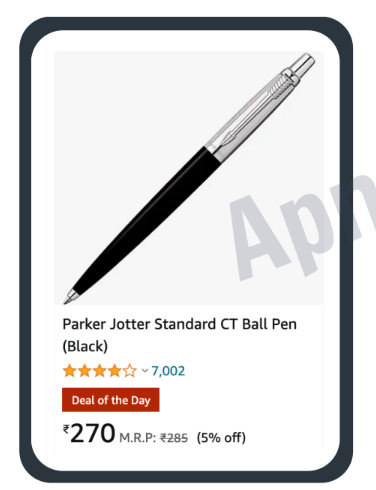

# 🌟 Practice Questions on Variables and Datatypes 🌟

Welcome to the practice questions repository! 🎉
Here, you'll find exercises to help you strengthen your knowledge of **variables and datatypes** in JavaScript. Let's dive in!

---

## 📌 Question 1: **Create a const object called “product” to store information shown in the picture.**



💡 **Hint**: Think about the properties you'd want in a product object like `name`, `price`, `color`, `rating` , `isOfferAvailable` , and `discount`. Use those to construct the object.

---

## 📌 Question 2: **Create a const object called “profile” to store information shown in the picture.**


💡 **Hint**: Consider storing user information like `username`, `numberOfPost`, `folowers`, `folowing` , `isFollowing` , and `description` in the profile object.

---

## 📚 Why Practice?

Practicing JavaScript and object creation helps:
- 🧠 Strengthen logical thinking.
- 🚀 Improve problem-solving skills.
- 💻 Prepare for real-world coding tasks.

---

## ⚙️ How to View the Solutions

### 1. **Clone the repository** to your local machine:
   - Open VSCode and use the integrated terminal to clone the repository.
   - Run the following command in VSCode terminal:
     ```bash
     git clone https://github.com/ananya0707/Learning-Javascript.git
     ```

### 2. **Open the `index.html` file in VSCode**:
   - After cloning, navigate to the folder where you saved the repo.
   - In VSCode, open the folder by going to `File` > `Open Folder`, then select the cloned repository folder.

### 3. **View the solution in the browser**:
   - Inside VSCode, find the `index.html` file in the Explorer panel.
   - Right-click on `index.html` and choose **"Open with Live Server"** (make sure you have the Live Server extension installed in VSCode).
     - If you don't have it, you can install the **Live Server** extension from the VSCode marketplace.
   - The page will open in your default web browser, and you’ll see the JavaScript solution directly on the page.

---

## 📝 Additional Resources

- [MDN JavaScript Guide](https://developer.mozilla.org/en-US/docs/Web/JavaScript/Guide)
- [JavaScript Object Documentation](https://developer.mozilla.org/en-US/docs/Web/JavaScript/Reference/Global_Objects/Object)

---

### Let's get coding and have fun! 😎🎉
